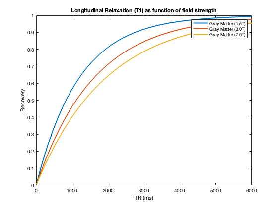
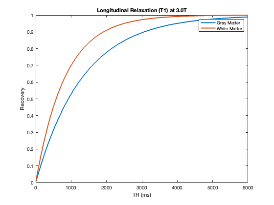
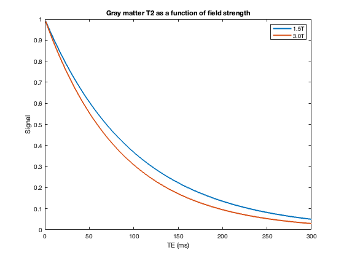
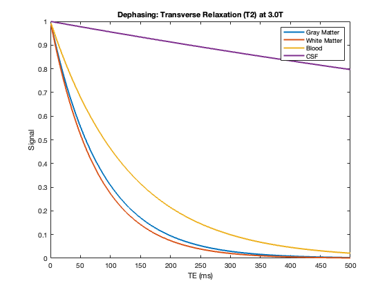
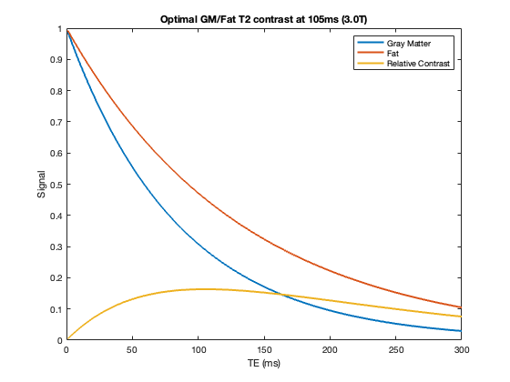
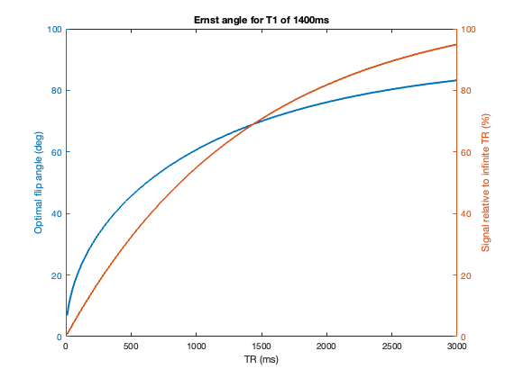

## MRI Contrast

This page describes Matlab scripts which generate some simple graphs to demonstrate basic principles of MRI. T2 and T1 relaxation are two properties we can use to adjust contrast (how bright a tissue will appear). 

We often want to create an image where the image brightness helps us define the border between tissue types (e.g. defining the edge between gray and white matter). Note that every scan is influenced by both T2 and T1 effects to some extent. However, if we choose a sequence with short echo times (TEs) and repeat times (TRs), T1 effects will predominate the resulting “T1-weighted” image. On the other hand, with long TRs and TEs the T2 effects will dominate (a T2-weighted image). However, many sequences mix these effects, for example a ‘proton density’ scan uses a long TR with a short TE such that the resulting brightness reflects the concentration of hydrogen regardless of tissue type (a balanced scan).

##### T1 and field strength

[T1 relaxation](https://en.wikipedia.org/wiki/Spin-lattice_relaxation_time) refers to the how rapidly nuclei return to alignment with the magnetic field (longitudinal relaxation). T1 relaxation is directly related to the delay between the radio-pulses which excite the nuclei (the repeat time, TR). While there will be more alignment at higher field strengths, the proportional rate of this change is slower at higher field strengths. This is one reason why TRs are often slower for higher field strengths. This also explains why some motion contrast are disproportionally better at higher field strengths (e.g. better saturation for static tissue for time-of-flight scans). This is illustated by the `t1_fieldstrength.m` script.

 - [Wikipedia entry for T1 relaxation](https://en.wikipedia.org/wiki/Spin-lattice_relaxation_time) 

##### T1 and tissue type

[T1 relaxation](https://en.wikipedia.org/wiki/Spin-lattice_relaxation_time) refers to the how rapidly nuclei return to alignment with the magnetic field (longitudinal relaxation). T1 relaxation is directly related to the delay between the radio-pulses which excite the nuclei (the repeat time, TR). Some tissues (e.g. gray matter) recover more slowly than others (e.g. white matter). We can exploit this with a sequence where the repetition time is very short. While all tissues will show less recovery with short TRs (and hence less signal than if a longer TR was used), the white-matter will show relatively more recovery than gray-matter, helping to differentiate these two tissues. This is illustated by the `t1_tissue.m` script.

#####  T2 and  field strength

[T2 relaxation](https://en.wikipedia.org/wiki/Relaxation_(NMR)#T2) refers to the how rapidly nuclei fall out of phase (transverse relaxation). T2 relaxation is directly related to the delay between when we transmit a radio-pulse to the time when we record the radio signal being emitted (the echo time, TE). Since nuclei spin faster at higher field strengths, they tend to fall out of phase more rapidly. This is one reason why TEs are often shorter for higher field strengths. Likewise, hydrogen T2 varies with tissue type. This image shows the T2 effects for gray matter at 1.5 Tesla and 3.0 Tesla. This is illustated by the `t2_fieldstrength.m` script. The effects mean we need to be careful when translating MRI sequences between scanners with different field strengths.

#####  T2 and tissue type

[T2 relaxation](https://en.wikipedia.org/wiki/Relaxation_(NMR)#T2) refers to the how rapidly nuclei fall out of phase (transverse relaxation). T2 relaxation is directly related to the delay between when we transmit a radio-pulse to the time when we record the radio signal being emitted (the echo time, TE). Since nuclei spin faster at higher field strengths, they tend to fall out of phase more rapidly. This is one reason why TEs are often faster for higher field strengths. Likewise, hydrogen T2 varies with tissue type. This image shows the T2 effects for several different tissue types. This is illustated by the `t2_tissue.m` script. As seen in the image, the signal from all tissues reduce with longer echo times. However, water (e.g. cerebral spinal fluid, CSF) retains signal much better than other tissues. Therefore, with longer echo times water will be the only tissue visible in a scan.

What is the optimal echo time? This depends on our field strength and the tissues we want to discriminate. The script `t2_contrast.m` examines the signal generated by fat (which predominates white matter) and gray matter at 3-Tesla. Note that a shorter echo time always generates more signal, regardless of tissue. If our echo time is extremely short, both fat and gray matter generate strong signal, so both will look the same (they are both bright). With a very long echo time, both will produce little signal (both will be black). However, an echo time of around 100ms maximally distinguishes these two signals.

##### TR and flip angle

With short delays between RF pulses (TRs) there will be little longitudinal recovery (T1 relaxation). In this case, sending in a strong RF pulse to induce a 90-degree flip will lead to less signal than a weaker pulse that induces a shallower flip angle. The [Ernst angle](https://en.wikipedia.org/wiki/Ernst_angle) refers to the optimal flip angle for a given TR. This graph shows the Ernst angle as a function of TR (blue line). The graph also shows the relative signal versus an infinite TR (green). This latter effect shows the diminishing returns seen with shorter TRs: for example a TR of 500ms returns 42% signal (relative to infinite TR), while a 1000m scan returns 59%. Therefore, while scanning twice as fast will provide twice as many samples, each sample will be noisier. Note that as previously described T1 varies with both tissue type and field strength. This graph uses Mark Cohen’s suggestion for an approximate T1 of 1400ms for the brain using a 3T scanner (if your scanner is not 3T, take a look at “T1 and field strength” for approximations). The Matlab script `tr_flipangle.m` illustrates this.

##### Links

 - [Martín-Pastor’s online calculator](https://www.mritoolbox.com/ErnstAngle.html) 
 - [Flip Angle for T2* (fMRI BOLD) contrast](https://pubmed.ncbi.nlm.nih.gov/21073963)